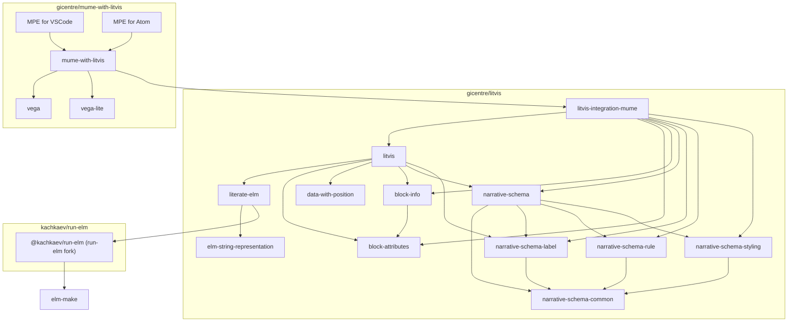

# Litvis NPM packages

_Litvis_ as a framework for interpreting markdown documents can have multiple implementations in various programming languages.
A reference implementation of litvis has been developed using [TypeScript](https://www.typescriptlang.org/), a typed superset of JavaScript.
Most of this open-source software can be found in https://github.com/gicentre/litvis → `packages` directory and the remaining bits are located in these repositories:

- [gicentre/mume-with-litvis](https://github.com/gicentre/mume-with-litvis)
- [gicentre/markdown-preview-enhanced-with-litvis](https://github.com/gicentre/markdown-preview-enhanced-with-litvis)
- [gicentre/vscode-markdown-preview-enhanced-with-litvis](https://github.com/gicentre/vscode-markdown-preview-enhanced-with-litvis)

## Software dependency diagram



## Development

The core packages in the litvis ecosystem are organised in a form of a _monorepo_ (a single git repository where multiple npm packages are co-located).
This repository uses [`yarn` workspaces](https://yarnpkg.com/lang/en/docs/workspaces/) for common dependency management and `lerna` for orchestrating `package.json` scripts and for publishing to npm.

Before getting started, please make sure you have the latest `node` and the latest `yarn` installed on your machine.

```bash
node --version
## >= 9.11

yarn --version
## >= 1.6.0
```

### Installing dependencies

```bash
# cd gicentre/litvis
yarn
```

### Building packages

```bash
## once
yarn build

## continuously
yarn build:watch
```

### Quality control

#### Linting

```bash
yarn lint
```

#### Testing

```bash
yarn test
```

#### Checking file formatting with [Prettier](https://prettier.io/)

```bash
yarn format:check
```

#### Running all checks

```bash
yarn qa

yarn build-and-qa
## ‘build-and-qa‘ is recommended for ‘cold start’
## (i.e. when packages have not been built previously)
```
